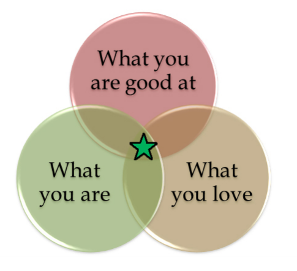

# IIT Madras offering Career Guidance to Government school students with the CSR Support from NSFDC.

Most students in India enter their undergraduate studies without really have chosen their courses themselves. As a result, at the end of graduation, they end up not knowing what to do and their employability is becoming a key challenge.  Instead of pursuing a career of their choice and interest, a student’s aspiration, very often, is fuelled by the pressure to meet parental and societal expectations. Career guidance, therefore, it is absolutely necessary in India because students need to be mentally prepared to face the world after graduation. We want to work together to create youngsters who have a positive outlook towards life, while also being responsible and accountable for themselves. As part of this career guidance initiative, we want to request parents to work with the schools closely to understand the student’s interests and capabilities.

 

As part of CSR initiative from NSFDC, IIT Madras is offering free career guidance to students in the 9th and 10th class. National Scheduled Castes Finance and Development Corporation (NSFDC) is supporting the career guidance initiative from IIT Madras as part of its CSR initiatives. Career Guidance Program was conducted in a school run by a BSP Education Society, a non-Profit organization is promoting Women Education and Empowerment located in Jattari, Uttar Pradesh. This program is conducted for 120 students from 10th standard. Teachers and Students actively participated during the program. All the students have taken MCMF assessment in Hindi Language. My Choice My Future (MCMF), an online personality assessment solution for career guidance in the Indian context. MCMF empowers school and college students, and professionals discover their true personalities and map their modal personality traits to suitable career clusters. MCMF is a simple 72-question survey that provides detailed insights into students’ dominant Personalities and Career Interests. It helps the students and their teachers gain an understanding of the abilities, and assist them with their doubts and apprehensions. Especially for students of class 9 and 10, it proved to be a guiding light to help make the right decision after their board exams.

As part of the Career Guidance program, the following activities are conducted.
1. Trained teachers by creating awareness on MCMF assessment, MCMF benefits, MCMF Framework and Career Guidance
2. Conducted MCMF psychometric assessment to all the students.
3. Personalized analysis reports are printed and distributed to all the students.
4. MCMF report interpretation session is conducted for all the students. This session helps students to understand the MCMF report effectively and queries are answered.
5. Career Guidance workshop is conducted for all the students. This helps students to understand various career choices available and plan their career accordingly.

With MCMF Indian Language Editions, students and professionals can self-assess their personality in seven major Indian languages – Hindi, Bengali, Kannada, Malayalam, Marathi, Tamil, and Telugu, besides English. MCMF Indian language editions fill a long-felt gap in career guidance tools that cater to non-English speaking populations in India. MCMF was developed by BodhBridge ESPL, in collaboration with senior professors and researchers at the Department of Management Studies, Indian Institute of Technology, Madras. BodhBridge ESPL is an educational services company that was incubated by IIT Madras. MCMF assesses an individual on twelve personality traits. These twelve are classified into four basic personality traits and eight career-oriented personality traits. The basic personality traits are important irrespective of the career path an individual wishes to pursue.  The career-oriented personality traits are related to career domains.  Each personality trait is measured by six dimensions. At the end of the 30-minute assessment, test takers promptly receive an automatically-generated, comprehensive and personalized personality report.

The following parameters used as part of the MCMF Career Guidance Framework:
1.	Interest and Personality (Psychometric Test)
2.	Academic Performance (understanding the student’s strengths)
3.	Interest - personality - academic performance match
4.	Extra-curricular and Co-curricular activities
5.	Achievement or Hidden talents (typically ignored in the academic environment)

## Benefits of MCMF Career Guidance
•	The test taker, student or professional, obtains tangible insights into their dominant career-related personality traits, to make informed and purposive career-related decisions.
•	Parents will be able to understand salient aspects of their child’s evolving personality in relation to career interests, and support their child’s personal development and career-related choices.
•	School and career counsellors will obtain objective information on the personality profiles of students and other individuals, to offer effective, meaningful career counselling and advice to choose suitable career paths.

## Need for using MCMF Indian language editions
•	Language options capture a test taker’s career interests and personality variables more accurately for those who are not adequately exposed to the English language.
•	Students from schools with vernacular medium of instruction can receive the right career guidance during important academic milestones.
•	Government-supported skill development and education programs can expand their reach into the child and youth population that lives beyond urban areas.
•	Indian language editions for this online assessment contribute to the Government of India’s Digital India initiatives.
