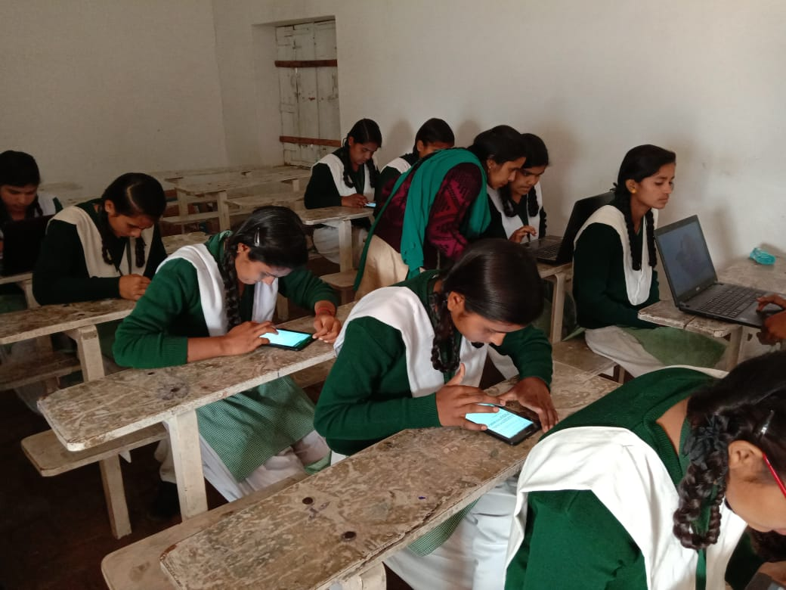
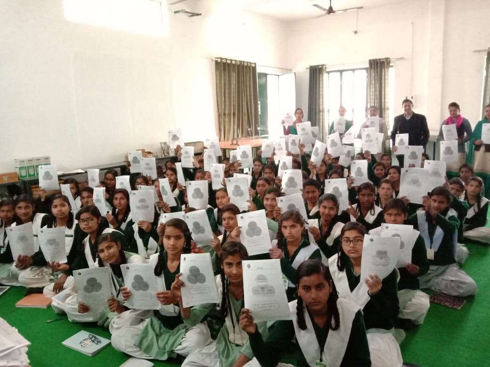

### IIT Madras offering Career Guidance to school students in UP and West Bengal with the CSR Support from NSFDC.

As part of CSR initiative from NSFDC, IIT Madras is offering free career guidance to students in the 9th and 10th class. National Scheduled Castes Finance and Development Corporation (NSFDC) is supporting the career guidance initiative from IIT Madras as part of its CSR initiatives. Career Guidance Program was conducted in few schools in West Bengal and Uttar Pradesh. My Choice My Future (MCMF), an online personality assessment solution for career guidance in the Indian context. MCMF empowers school and college students, and professionals discover their true personalities and map their modal personality traits to suitable career clusters. MCMF is a simple 72-question survey that provides detailed insights into students’ dominant Personalities and Career Interests. It helps the students and their teachers gain an understanding of the personality strengths, and help them to identify the areas of improvement. 

As part of the Career Guidance program in UP and West Bengal, the following activities are conducted.
Step 1. Trained teachers by creating awareness on MCMF assessment, MCMF benefits, MCMF Framework and Career Guidance
Step 2. Conducted MCMF psychometric assessment to all the students. This program was conducted for 120 students from 9th and 10th standard in a school run by Bagwati Paliwal Education Society at Jattari in UP. All the students have taken MCMF assessment in Hindi Language. BSP Education Society, is a non-Profit organization is promoting Women Education and Empowerment located in Jattari, Uttar Pradesh. Also, the MCMF psychometric assessment (Bengali Version) was conducted for around 100 students in Panighata UDM High School in Nadia District in West Bengal.
 

Step 3. After completing the psychometric, every student will receive a personalized analysis report. This personalized report helps students to understand their strengths and suitable career options. These reports are generated in regional languages (Hindi and Bengali). Personalized analysis reports are printed and distributed to all the students.
	

 

Step 4. MCMF report interpretation session is conducted for all the students. This session helps the students to understand the MCMF report effectively and queries on the report are answered.

Step 5. Career Guidance workshop is conducted for all the students. This helps students to understand various career choices available so that they can plan their career accordingly. Especially, for students of class 9 and 10, it is proving to be a guiding light to help them make right decisions after their board exams.

