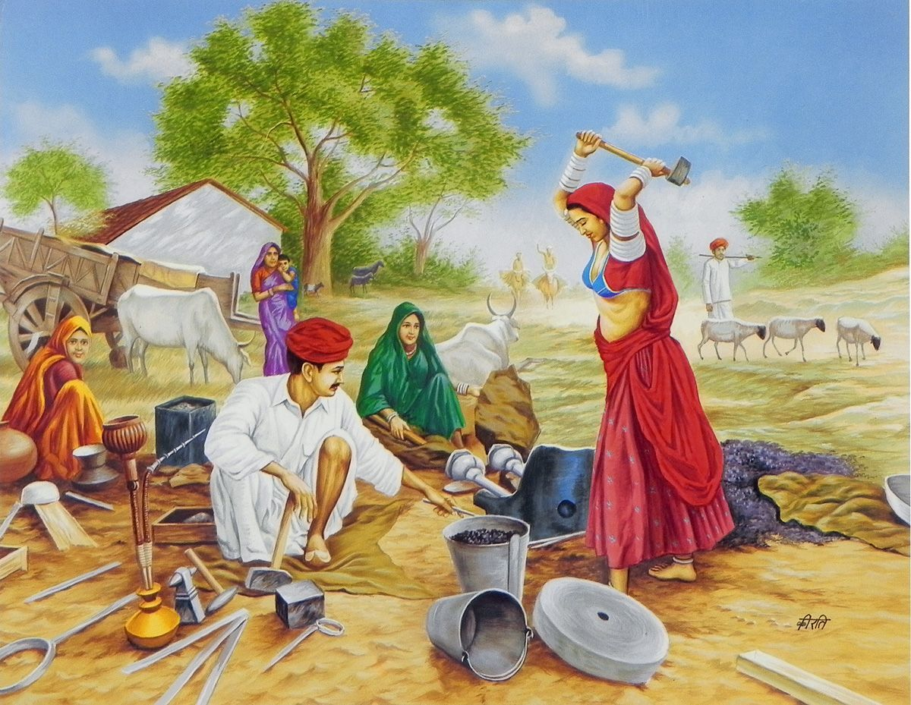

This blog is dedicated to all the young individuals out there who are trying to find a foothold in the world and figure out the all-important question of CAREER!
 
 
The career question is not an easy one. We agree.
And it is often made even more complicated with free advice flowing from all and sundry. Parents, siblings, friends, teachers, uncles, aunts – nearly everyone in the world - except you -  know how exactly you should go about seeking a great career.
“Get your math fundas straight.”
“Learn programming languages.”
“Take machine learning courses.”
“Go to Shiva temple everyday”
“Get a taveez!!!”

Advices abound.

Everyone has something to tell you, but no one asks you the one question that matters: 
“What do YOU like to do?”
There are other questions, equally important, subsumed by the first one - 
What are your natural motivations?
How do you motivate yourself?
How do you motivate others?
How do you lead others?
How can you be a constant learner?
How do you succeed at what you set out to achieve?
How did others do it?

These are some of the questions for which this blog will seek out answers. The answers will come from experts, from others who are taking the journey, from books etc.

Rise-Lead-Serve is the name and theme of this blog. The idea keeps showing up in various posts of the blog. Because we believe that anyone who succeeds in life goes through these three great stages:
1.	Rise – first you will awaken to a problem, embrace a goal, rise and walk towards the goal.
2.	Lead – the journey you will embark on will not be a lonely one. Sooner or later others will join and you will lead them.
3.	Serve – the group that had just formed around you will then serve a section of the society and fulfill a need.

The blog seeks to particularly reach out to young aspiring individuals in rural India. Therefore, as far as possible we will try to publish posts in Indian languages.

 

This blog is run by a small group of faculty at Indian Institute of Technology Madras, who are engaged in outreach activities outside their regular professional work that involves research and teaching. 
Therefore this blog will cover their outreach activities often conducted in collaboration with corporates, NGOs, schools etc.
The topics covered in the blog include: career guidance, motivation, leadership, team building, school education, success stories etc. 

Hope you enjoy the blog and join hands with us!

 

